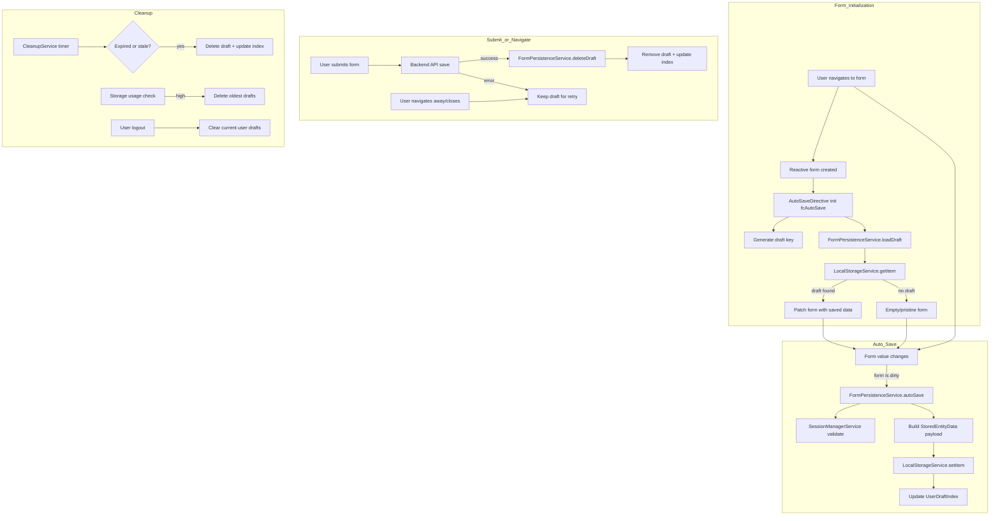

# PlanB. Angular Form Cache Library

> [!CAUTION]
> This library is currently in development and has no release version yet!

## Basic architecture and flow

This diagram shows the basic flow of the data inside the library

The `Form_Initialization` part is handled automatically via the `fcAutoSave` directive. For deletion of a draft after form submit/save the user manually needs to call the delete function on the draft service. Cleanup processes are handled automatically by the cleanup service.
