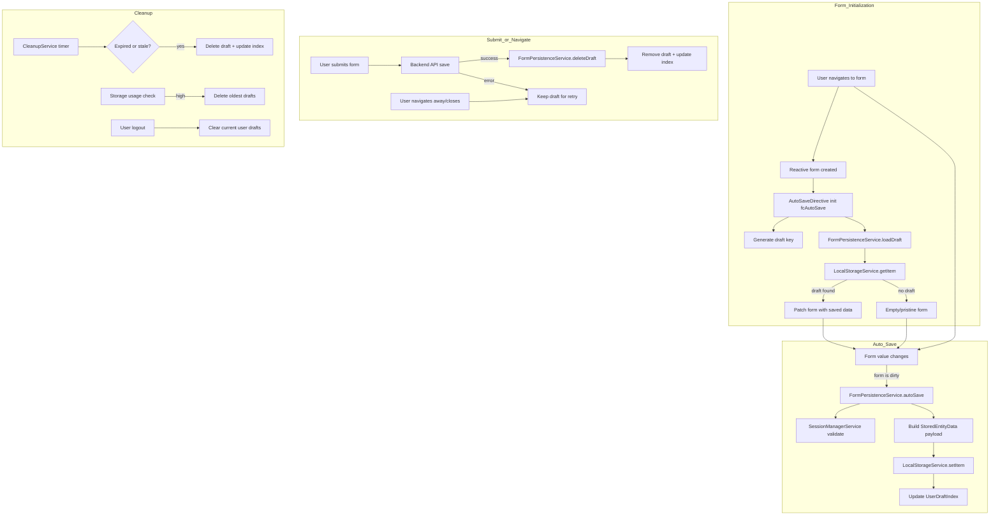

# PlanB. Angular Form Cache Library


> [!CAUTION]
> This library is currently in development and has no release version yet!

## Angular compatibility

Supports Angular **20, 21, and 22**, including standalone applications and zoneless change detection.
Use matching major versions of `@angular/common`, `@angular/core`, and `@angular/forms` in your application.
RxJS `^6.5.3 || ^7.4.0` is a peer dependency, matching Angular's supported range.

The published library is built with Angular 20 and partial-Ivy compilation. Keeping the build on the
oldest supported Angular major preserves compatibility with Angular 20 consumers while newer
applications link the package with their own compiler. See
[Angular's library compatibility guidance](https://angular.dev/tools/libraries/creating-libraries#ensuring-library-version-compatibility).
Future Angular majors should be added to the peer range after passing the compatibility suite.

### Development and compatibility checks

Use Node.js 24.15 or later in the 24.x line, which supports all three Angular majors
([Angular compatibility table](https://angular.dev/reference/versions)).

```sh
npm ci
npm run lint
npm test
```

`npm test` builds the library once, packs it, and installs that artifact into isolated Angular 20,
21, and 22 consumers. Each consumer compiles a standalone application and runs browser tests
against the public package API with zoneless change detection. Chrome must be installed;
set `CHROME_BIN` to use another Chromium executable. To check one major after building, run
`npm run test:compatibility -- 21`. Temporary consumers are removed after successful checks and
retained on failure for diagnosis. An additional Angular 20.0 / TypeScript 5.8 / RxJS 6 consumer
checks the oldest supported Angular minor. CI runs each target separately.

## Basic architecture and flow

This diagram shows the basic flow of the data inside the library


```mermaid
flowchart TD
  %% Sample Form Data Flow with Draft Caching (simplified, parser-friendly)

  subgraph Form_Initialization
    U[User navigates to form] --> F[Reactive form created]
    F --> D[AutoSaveDirective init fcAutoSave]
    D --> K1[Generate draft key]
    D --> FP[FormPersistenceService.loadDraft]
    FP --> LSget[LocalStorageService.getItem]
    LSget -->|draft found| P[Patch form with saved data]
    LSget -->|no draft| E[Empty/pristine form]
  end

  subgraph Auto_Save
    VC[Form value changes] -->|form is dirty| AS[FormPersistenceService.autoSave]
    AS --> SM[SessionManagerService validate]
    AS --> SD[Build StoredEntityData payload]
    SD --> LSset[LocalStorageService.setItem]
    LSset --> IDX[Update UserDraftIndex]
  end

  subgraph Submit_or_Navigate
    SUB[User submits form] --> API[Backend API save]
    API -->|success| DEL[FormPersistenceService.deleteDraft]
    DEL --> Rm[Remove draft + update index]
    API -->|error| KEEP[Keep draft for retry]
    NAV[User navigates away/closes] --> KEEP
  end

  subgraph Cleanup
    CL[CleanupService timer] --> TTL{Expired or stale?}
    TTL -->|yes| GC[Delete draft + update index]
    QU[Storage usage check] -->|high| TRIM[Delete oldest drafts]
    LOG[User logout] --> CLR[Clear current user drafts]
  end

  %% Flow connections
  U --> VC
  P --> VC
  E --> VC

```

The `Form_Initialization` part is handled automatically via the `fcAutoSave` directive. For deletion of a draft after form submit/save the user manually needs to call the delete function on the draft service. Call `CleanupService.start()` once during browser application startup to enable periodic cleanup. Start or resume a matching session with `SessionManagerService` before saving drafts; see the [quickstart](docs/ng-form-cache/docs/getting-started/quickstart.md).
